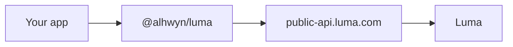

<Warning>
  This SDK is under construction and not ready for production use. It is not affiliated with or maintained by Luma.
</Warning>

The `@alhwyn/luma` package is a TypeScript client for the [Luma public API](https://public-api.luma.com). It wraps REST endpoints for users, calendars, events, guests, ticket types, and webhooks with typed methods and responses.

<Note>
  You need a [Luma Plus](https://luma.com) organization to use the API. See the [Luma getting started guide](https://docs.luma.com/reference/getting-started-with-your-api) for official setup.
</Note>

## How it works

You pass an API key to the `Luma` client. The SDK adds the `x-luma-api-key` header and calls the same endpoints documented in the official Luma API.

## Get started

<Steps>
  <Step title="Install the package">
    [Install](/install) `@alhwyn/luma` from GitHub Packages.
  </Step>
  <Step title="Add your API key">
    Create a key at [Luma API keys](https://luma.com/calendar/manage/api-keys) and set `LUMA_API_KEY`. See [Authentication](/authentication).
  </Step>
  <Step title="Test against the live API">
    Run `luma users get` or follow [Test your setup](/test-your-setup) to confirm everything works.
  </Step>
  <Step title="Build your integration">
    Use the resource guides below, or explore endpoints in the **API reference** tab.
  </Step>
</Steps>

## Documentation

<CardGroup cols={2}>
  <Card title="Test your setup" icon="flask" href="/test-your-setup">
    Smoke-test your API key against the live Luma API.
  </Card>
  <Card title="Usage" icon="code" href="/usage">
    Client resources, pagination, and TypeScript types.
  </Card>
  <Card title="Events" icon="calendar" href="/events">
    List, create, and manage events, guests, and tickets.
  </Card>
  <Card title="Webhooks" icon="webhook" href="/webhooks">
    Register endpoints and verify incoming events.
  </Card>
  <Card title="API reference" icon="book" href="/api-overview">
    Interactive docs from the official Luma OpenAPI spec.
  </Card>
  <Card title="CLI" icon="terminal" href="/cli">
    Quick commands for users and events.
  </Card>
</CardGroup>

## SDK vs official API docs

| | This SDK | [docs.luma.com](https://docs.luma.com) |
| --- | --- | --- |
| Purpose | TypeScript client for `@alhwyn/luma` | Official Luma API reference |
| Auth | `new Luma(apiKey)` | `x-luma-api-key` header |
| Testing | [Test your setup](/test-your-setup), CLI, API playground tab | Official playground |

Use this site to learn the SDK. Use the **API reference** tab (or [docs.luma.com](https://docs.luma.com)) for raw endpoint details.
